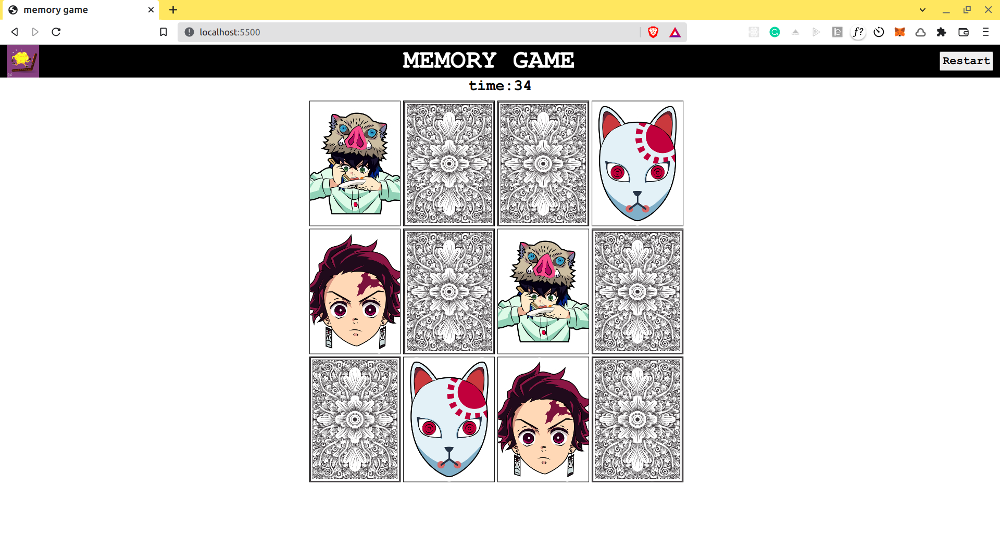

# Memory game

a simple memory game using HTML,CSS, JS

## How to run locally
just clone the repository or download the files and open `index.html`

## Contributing

1. Fork this repo and clone it to your system.
2. Get the issue assigned to you on the ContriHUB website.
3. Make the required changes. Please keep your changes relevant only to the issue specified.
4. Add your name in the [CONTRIBUTORS.MD](CONTRIBUTORS.md) file
5. Create a PR with your changes and a detailed description of the changes you have made.
6. Submit the PR link on the ContriHUB website.

For major changes, please open an issue first to discuss what you would like to change.

## NOTE: 
you must only use HTML,CSS,JS only. No other library or framework is allowed for this project
## Contributors
A list of contributors can be found in [CONTRIBUTORS.MD](CONTRIBUTORS.md)